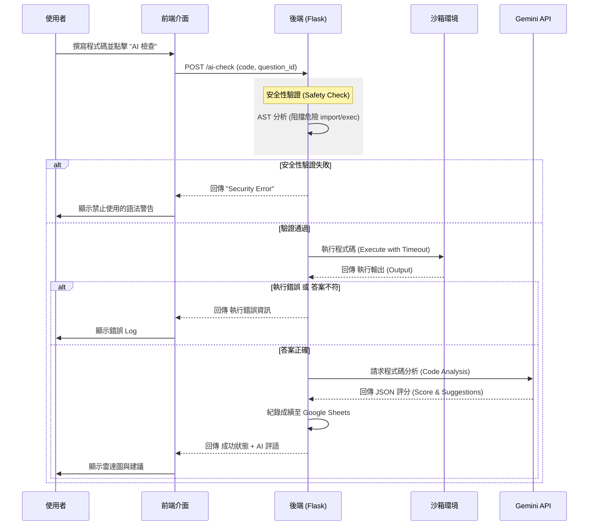
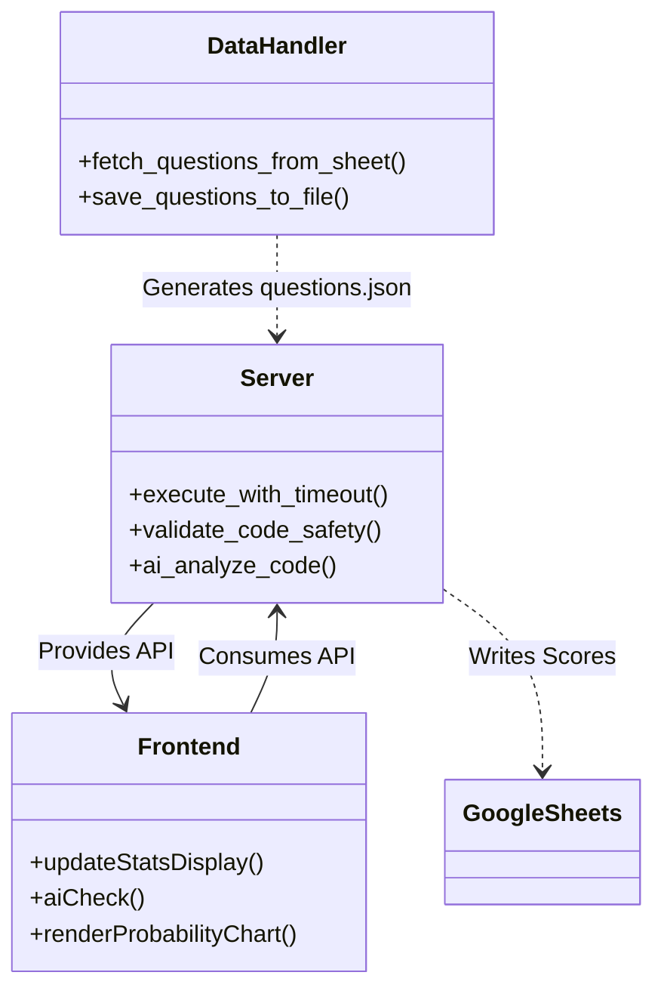

# VibeCodingLab 專案說明文件

## 專案總覽 (Project Overview)

**VibeCodingLab** 是一個互動式的 Python 程式設計學習平台（Web Application），旨在透過即時的程式碼執行與 AI 輔助評分，幫助使用者練習 Python 程式題。

- **解決的問題**：提供一個安全、即時回饋的 Python 練習環境，解決傳統練習缺乏即時指導與程式碼品質分析的問題。
- **使用對象**：Python 初學者、程式設計學生。
- **專案性質**：Web Application (Frontend + Backend)。

主要特色包含：
- **安全沙箱執行**：在後端安全地執行使用者提交的 Python 程式碼。
- **AI 智慧評分**：整合 Google Gemini API，針對程式碼的正確性、時間/空間複雜度、易讀性進行多維度評分。
- **即時回饋**：提供執行結果與 AI 建議，引導使用者優化程式碼。
- **題目管理**：整合 Google Sheets 作為題目與成績的後台資料庫。

## 系統架構說明 (Architecture Overview)

本系統採用經典的前後端分離架構。前端負責使用者介面與互動，後端負責核心邏輯、程式碼安全執行與 AI 整合。

- **Frontend**: 使用原生 HTML/CSS/JavaScript 建構，整合 Monaco Editor 提供 IDE 等級的編輯體驗。
- **Backend**: 使用 Python Flask 框架，處理 API 請求、管理與 Google Sheets 的同步，並實作程式碼沙箱 (Sandbox)。
- **AI Service**: 整合 Google Gemini API 進行程式碼理解與評分。
- **Database**: 使用 JSON 檔案快取題目資料，並以 Google Sheets 作為持久化資料源。

```mermaid
graph TD
    User((使用者)) -->|HTTPS| Frontend[Frontend (Browser)]
    
    subgraph "Local / Server Environment"
        Frontend -->|API Request| Flask[Backend Server (Flask)]
        Flask -->|Safe Execute| Sandbox[Python Sandbox]
        Flask -->|Read/Write| Config[JSON Config & Data]
    end
    
    subgraph "External Services"
        Flask -->|Generate Content| Gemini[Google Gemini API]
        Flask -->|Sync Data| GSheets[(Google Sheets)]
        Frontend -.->|Tunneling| Ngrok[Ngrok Tunnel]
    end
    
    style Frontend fill:#f9f,stroke:#333,stroke-width:2px
    style Flask fill:#bbf,stroke:#333,stroke-width:2px
    style Sandbox fill:#bfb,stroke:#333,stroke-width:2px
```

## 系統流程說明 (System Flow)

以下展示使用者提交程式碼進行「AI 檢查」的核心流程：

1. **提交**：使用者在編輯器撰寫程式碼並點擊檢查。
2. **驗證**：後端先進行 AST (Abstract Syntax Tree) 安全性檢查，阻擋危險函數。
3. **執行**：在限制時間與權限的環境下執行程式碼，比對輸出與預期結果。
4. **AI 分析**：若執行正確，將程式碼傳送至 Gemini API 進行多維度評分。
5. **回饋**：前端接收並顯示評分雷達圖與改進建議。



## 資料夾結構說明 (Folder Structure)

| 資料夾/檔案 | 類型 | 說明 |
|------------|------|------|
| `VibeCodingLab/` | Root | 專案根目錄 |
| ├── `server.py` | File | **核心後端程式**。負責啟動 Flask Server、處理 API、整合 Gemini 與執行 Python 程式碼。 |
| ├── `fetch_questions.py` | File | **資料同步工具**。用於從 Google Sheets 下載題目並更新至 `questions.json`。 |
| ├── `frontend/` | Dir | **前端程式碼目錄**。 |
| │   ├── `index.html` | File | 網頁入口，包含主介面結構。 |
| │   ├── `script.js` | File | 前端核心邏輯 (IDE 整合、API 呼叫、狀態管理)。 |
| │   ├── `config.js` | File | 前端設定檔 (主要定義 API_URL)。 |
| │   └── `questions-manager.js`| File | 題目管理邏輯 (渲染題目列表、切換題目)。 |
| ├── `api_keys.json` | File | **敏感設定**。儲存 Gemini API Keys 列表 (GitIgnore 建議)。 |
| ├── `questions.json` | File | **資料快取**。從 Google Sheets 同步下來的題目資料。 |
| └── `verify_input_fix.py` | File | 輔助測試腳本。 |

## 核心模組與重要檔案 (Key Modules & Files)

### 1. Backend (`server.py`)
- **`execute_code`**: 核心沙箱函數。使用 `exec` 但配合 `validate_code_safety` (AST 檢查) 與 `builtins` 白名單，確保無法執行刪除檔案、網路請求等危險操作。
- **`ai_check_code`**: 評分流程控制器。串接執行結果與 `get_gemini_model`，回傳結構化的 JSON 評分。
- **`init_gspread_client`**: 負責與 Google Sheets 建立連線，保存學生成績。

### 2. Frontend (`frontend/script.js`)
- **`monacoEditor`**: 整合 Microsoft Monaco Editor (VS Code 核心)，提供語法高亮與自動完成。
- **`aiCheck`**: 處理使用者點擊「AI 檢查」的非同步請求，並解析後端回傳的 JSON 更新 UI (包含雷達圖)。

### 3. Data Sync (`fetch_questions.py`)
- 獨立運作的腳本，透過公開的 Google Sheets CSV 匯出連結 (`SHEET_URL`) 解析並重新生成 `questions.json`。

關係圖如下：



## 安裝與環境需求 (Installation & Requirements)

### 系統需求
- **OS**: Windows / macOS / Linux
- **Python**: 3.8+
- **Google Cloud API Access**: 需具備 Gemini API Key。

### 相依套件 (Dependencies)
請參考專案中的 import 需求，主要套件如下：
- `flask` (Web Framework)
- `flask-cors` (CORS Support)
- `google-generativeai` (Gemini AI SDK)
- `gspread` (Google Sheets API)
- `oauth2client` (Google Auth)

### 安裝步驟
1. 建立 Python 虛擬環境:
   ```bash
   python -m venv venv
   source venv/bin/activate  # Windows: venv\Scripts\activate
   ```
2. 安裝套件:
   ```bash
   pip install flask flask-cors google-generativeai gspread oauth2client requests
   ```
3. 設定 API Keys:
   確保 `api_keys.json` 存在且包含有效的 Gemini API Key 列表。

## 使用方式 (How to Use)

### 1. 啟動後端
在專案根目錄執行：
```powershell
python server.py
```
伺服器預設會在 `http://localhost:5000` 啟動。

### 2. 啟動/開啟前端
- **本地開發**: 直接用瀏覽器開啟 `frontend/index.html`。
- **遠端/手機測試**: 
  - 使用 ngrok 對映後端: `ngrok http 5000`
  - 修改 `frontend/config.js` 中的 `API_URL` 為 ngrok 網址。

### 3. 操作流程
1. 瀏覽器開啟頁面，左側選擇題目。
2. 中間編輯區撰寫 Python 程式碼。
3. 點擊 **"執行程式碼"** 進行單純測試 (不消耗 API Quota)。
4. 點擊 **"AI 檢查"** 進行評分與獲取建議 (需通過正確性測試)。

## 設定說明 (Configuration)

|設定檔| 關鍵參數 | 說明 |
|---|---|---|
| `frontend/config.js` | `API_URL` | 指定後端 API 地址，支援 localhost 或 ngrok URL。 |
| `api_keys.json` | `api_keys` | JSON string 陣列，存放多組 Gemini API Keys 以供輪替使用。 |
| `server.py` | `SCORES_SPREADSHEET_ID` | 設定 Google Sheets 的 ID，用於成績紀錄。 |
| `server.py` | `SAFE_BUILTINS` | 允許使用者使用的 Python 內建函數白名單。 |

## 開發者指南 (Developer Guide)

1. **修改題目**:
   - 不建議直接修改 `questions.json`。
   - 請更新 Google Sheets 來源，再執行 `python fetch_questions.py` 同步最新題目。

2. **擴充安全性**:
   - 若需開放更多 Python 模組 (如 `math`, `random`)，需修改 `server.py` 中的 `safe_import` 邏輯與 `SAFE_BUILTINS` 白名單。

3. **前端除錯**:
   - 使用 Chrome DevTools Console 查看 API 回傳的錯誤訊息。
   - 注意 CORS 問題，確保 `flask_cors` 設定正確。

## 已知限制與待辦事項 (Limitations & TODO)

### 已知限制 (Limitations)
- **程式碼沙箱**: 目前僅透過 Python `exec` 與 AST 檢查實作軟隔離，並非 Docker 級別的強隔離，請勿在生產環境直接暴露給未受信任的公開網路。
- **UI 狀態**: 重新整理頁面後，未保存的程式碼可能會遺失 (Local Storage 實作依賴前端邏輯)。
- **API 額度**: 高頻率請求可能觸發 Gemini API Rate Limit，後端雖有 Key 輪替機制，但仍受限於配額。

### 待辦事項 (TODO)
- [ ] 實作 Docker 容器化部署，增強沙箱安全性。
- [ ] 增加使用者登入系統，區分不同學生的學習歷程。
- [ ] 支援更多程式語言 (如 JavaScript, C++)。
- [ ] 優化前端 Mobile 體驗，改進虛擬鍵盤遮擋問題。

## 補充說明 (Notes)
- 本專案為了教學便利，將部分 API Key 與設定檔保留在專案結構中 (如 `api_keys.json`)，在正式開源或部署時請務必加入 `.gitignore`。
- 後端 `init_gspread_client` 支援 Service Account 與 API Key 兩種模式，請依據部屬環境選擇。
