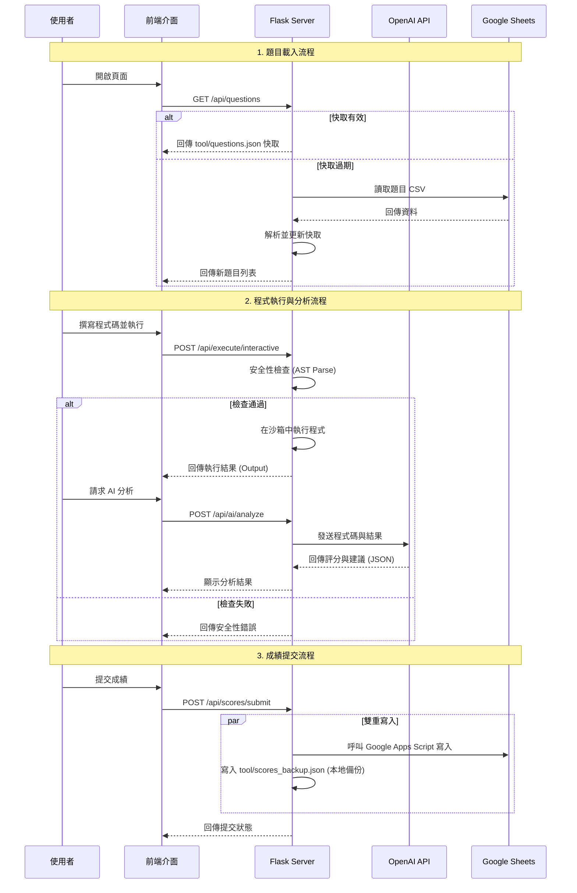

# VibeCodingLab (Python 智能診斷平台)

## 專案總覽 (Project Overview)
本專案是一個基於 Python Flask 的 Web 應用程式，旨在提供學生一個互動式的 Python 程式練習環境。系統結合了 OpenAI 的大型語言模型 (LLM)，能針對學生的程式碼提供即時的執行結果、錯誤分析、評分與優化建議。

- **解決的問題**：提供初學者即時且具體的程式碼回饋，解決自學時缺乏指導的痛點。
- **使用對象**：Python 程式語言初學者、程式設計課程學生。
- **專案性質**：Web Application (前後端分離架構)。

## 系統架構說明 (Architecture Overview)
本系統採用前後端分離設計。後端使用 Flask 框架處理 API 請求、程式碼安全性檢查與執行；前端使用純 HTML/CSS/JS 構建。外部依賴包括 OpenAI API (用於代碼分析) 與 Google Sheets (用於題目管理與成績記錄)。

### 系統架構圖
```mermaid
graph TD
    User[使用者 (Browser)] <-->|HTTP/JSON| Frontend[前端介面 (HTML/JS)]
    Frontend <-->|REST API| Backend[後端伺服器 (Flask)]
    
    subgraph Backend_System [後端系統]
        Backend -->|1. 驗證與執行| Sandbox[安全執行沙箱 (Safe Exec)]
        Backend -->|2. 題目管理| QuestionLoader[題目讀取模組 (Fetch Questions)]
        Backend -->|3. 成績處理| ScoreManager[成績管理模組]
    end
    
    subgraph External_Services [外部服務]
        Backend <-->|分析請求| OpenAI[OpenAI API]
        QuestionLoader <-->|讀取 CSV| GSheets[Google Sheets (題目資料庫)]
        ScoreManager -->|寫入成績| GWebApp[Google Apps Script (成績記錄)]
    end
    
    ScoreManager -->|備份| LocalFile[本地 JSON 檔案]
```

## 系統流程說明 (System Flow)
主要流程包含：題目載入、程式碼執行、AI 分析與成績提交。

### 核心運作流程圖

```mermaid
sequenceDiagram
    participant U as 使用者
    participant F as 前端介面
    participant S as Flask Server
    participant AI as OpenAI API
    participant DB as Google Sheets

    Note over U, DB: 1. 題目載入流程
    U->>F: 開啟頁面
    F->>S: GET /api/questions
    alt 快取有效
        S-->>F: 回傳 tool/questions.json 快取
    else 快取過期
        S->>DB: 讀取題目 CSV
        DB-->>S: 回傳資料
        S->>S: 解析並更新快取
        S-->>F: 回傳新題目列表
    end

    Note over U, DB: 2. 程式執行與分析流程
    U->>F: 撰寫程式碼並執行
    F->>S: POST /api/execute/interactive
    S->>S: 安全性檢查 (AST Parse)
    alt 檢查通過
        S->>S: 在沙箱中執行程式
        S-->>F: 回傳執行結果 (Output)
        
        U->>F: 請求 AI 分析
        F->>S: POST /api/ai/analyze
        S->>AI: 發送程式碼與結果
        AI-->>S: 回傳評分與建議 (JSON)
        S-->>F: 顯示分析結果
    else 檢查失敗
        S-->>F: 回傳安全性錯誤
    end

    Note over U, DB: 3. 成績提交流程
    U->>F: 提交成績
    F->>S: POST /api/scores/submit
    par 雙重寫入
        S->>DB: 呼叫 Google Apps Script 寫入
        S->>S: 寫入 tool/scores_backup.json (本地備份)
    end
    S-->>F: 回傳提交狀態
```

## 資料夾結構說明 (Folder Structure)

```
VibeCodingLab/14/
├── frontend/                  # 前端靜態資源
│   ├── index.html             # 主頁面
│   ├── styles.css             # 樣式表
│   ├── app.js                 # 主要邏輯 (Vue/Vanilla JS)
│   ├── api.js                 # API 封裝
│   ├── config.js              # 前端設定
│   └── lib/                   # 第三方函式庫
├── tool/                      # 工具與資料模組
│   ├── fetch_questions.py     # Google Sheets 題目抓取邏輯
│   ├── prompts.json           # AI 提示詞模板設定
│   ├── questions.json         # 題目資料快取
│   └── scores_backup.json     # 成績本地備份
├── server.py                  # 後端核心程式 (Flask App)
├── config.json                # 後端設定檔 (API Keys 等)
├── requirements.txt           # Python 套件依賴清單
└── service-account.json       # Google 服務帳號憑證 (選用)
```

## 核心模組與重要檔案 (Key Modules & Files)

### 1. `server.py` (後端核心)
- **職責**：啟動 Web Server，處理所有 API 路由。
- **關鍵功能**：
  - `validate_code_safety(code)`: 使用 AST (抽象語法樹) 檢查程式碼，禁止危險函數 (如 `open`, `eval`, `os` 等)。
  - `execute_with_timeout`: 在獨立執行緒中執行學生程式碼，防止無窮迴圈 (預設 5 秒超時)。
  - `start_interactive_execution`: 處理互動式程式執行 (支援 `input()` 函數)。
  - `/api/ai/*`: 處理與 OpenAI 的串接，包含分析、檢查與建議。

### 2. `tool/fetch_questions.py` (題目載入器)
- **職責**：從 Google Sheets CSV 匯出連結讀取題目資料。
- **邏輯**：
  - 解析 CSV 格式，處理用雙引號包夾的欄位。
  - 自動判斷題目難度與學習目標。
  - 將資料結構化並儲存為 JSON。

### 3. `frontend/app.js` (前端邏輯)
- **職責**：管理使用者介面互動。
- **功能**：
  - 程式碼編輯器 (CodeMirror/Monaco) 初始化。
  - 調用後端 API 執行程式並顯示結果。
  - 渲染 Markdown 格式的 AI 回饋。

## 安裝與環境需求 (Installation & Requirements)

### 系統需求
- Python 3.8 或以上版本
- 網路連線 (需存取 Google Sheets 與 OpenAI API)

### 相依套件
請參考 `requirements.txt`：
```text
flask
flask-cors
openai
requests
gspread
google-auth
```

### 安裝步驟
1. 建立虛擬環境 (建議)：
   ```bash
   python -m venv venv
   source venv/bin/activate  # Windows: venv\Scripts\activate
   ```
2. 安裝套件：
   ```bash
   pip install -r requirements.txt
   ```

## 使用方式 (How to Use)

### 1. 啟動伺服器
在專案根目錄執行：
```bash
python server.py
```
成功啟動後，控制台會顯示：
```
[Vibe] Python 診斷平台 - OpenAI 版 (Model: gpt-4o-mini)
 * Running on http://0.0.0.0:5000/
```

### 2. 操作介面
- 打開瀏覽器訪問 `http://localhost:5000` (或 `index.html` 直接打開，視前端配置而定)。
- 選擇左側題目列表。
- 在中央編輯器輸入 Python 程式碼。
- 點擊「執行程式」查看輸出。
- 點擊「AI 分析」獲取評分與建議。

## 設定說明 (Configuration)

### 後端設定 (`config.json`)
此檔案需自行建立，格式如下：
```json
{
  "openai_api_key": "sk-proj-...",
  "model_name": "gpt-4o-mini"
}
```

### 提示詞設定 (`tool/prompts.json`)
定義 AI 分析時使用的 System Prompt 與 User Prompt 模板，可熱更新。
- `analyze_prompt`: 用於 `/api/ai/analyze`
- `suggest_prompt`: 用於 `/api/ai/suggest`

## 開發者指南 (Developer Guide)

### 修改建議
1. **安全性調整**：
   - 若需開放更多 Python 模組，請修改 `server.py` 中的 `ALLOWED_MODULES` 集合。
   - **警告**：請勿隨意移除 `validate_code_safety` 中的檢查，以免造成伺服器安全風險。

2. **題目來源**：
   - 目前指向特定的 Google Sheet URL (在 `tool/fetch_questions.py` 中定義)。
   - 若需更換題庫，請修改 `SHEET_URL` 常數。

### 擴充功能
- **新增 API**：在 `server.py` 中使用 `@app.route` 裝飾器新增路由。
- **前端調整**：主要修改 `frontend/app.js` 與 `frontend/index.html`。

## 已知限制與待辦事項 (Limitations & TODO)

- **安全性限制**：
  - 目前僅支援標準函式庫的子集 (math, random, datetime 等)。
  - 無法執行需要檔案系統讀寫的操作。
  - `input()` 互動功能在某些瀏覽器環境下可能會有延遲。

- **TODO**：
  - [ ] 實作使用者登入系統。
  - [ ] 將成績儲存改為真正的資料庫 (如 SQLite/PostgreSQL)，而非依賴 Google Sheets。
  - [ ] 增強沙箱隔離機制 (考慮使用 Docker 或更底層的隔離)。

## 補充說明 (Notes)
- **成績備份機制**：系統會優先嘗試寫入 Google Apps Script Web App。若失敗，會自動降級並寫入 `tool/scores_backup.json`，確保資料不丟失。
- **快取機制**：題目資料預設快取 30 分鐘 (`server.py` 中的 `CACHE_EXPIRE_MINUTES`)，可透過 `/api/questions/refresh` 強制更新。
